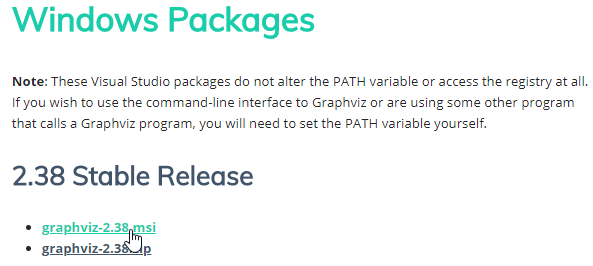
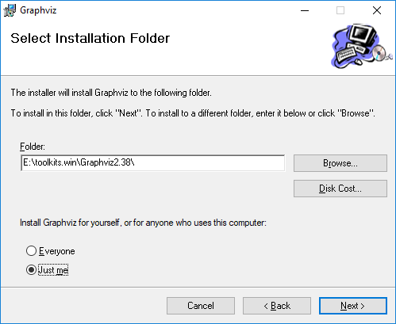
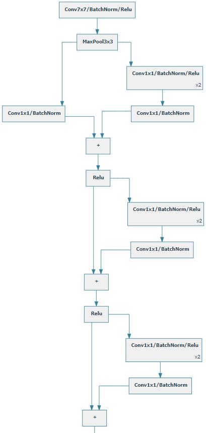

# WeightWatcher
This version of `weightwatcher` works on Windows and Ubuntu. It supports PyTorch and Tensorflow.

## To Do

- General stuff
	- [ ] Add Ubuntu yml file to env setup section
	- [ ] Add Ubuntu setup instructions for GraphViz
	- [ ] Add `tf_watch_demo.ipynb` and `img/tf_watch.png`
	- [ ] Replace sample weightwatcher PNGs with animated GIFs
  
## Environment Setup

The code in this repo was developed and tested using Anaconda3 v.5.1.0. To reproduce our Windows conda environment, please use the following files:

*Tensorflow:*
- [dlwin36tf.yml](setup/dlwin36tf170.yml) 

*PyTorch:*
- [dlwin36torch.yml](setup/dlwin36torch.yml)

## Graphviz install steps on Windows

Here are the steps required for `weightwatcher` to work on Windows:

### Install 

1. Get the latest **stable** windows MSI install package from the official Graphviz [download page](https://graphviz.gitlab.io/_pages/Download/Download_windows.html):



> Note: At the time of this writing, the latest stable version is `2.38`.

2. Install the Graphviz executable files in your favorite development toolkit folder (in our case, `E:\toolkits.win`):



3. Define a system environment (sysenv) variable named `GRAPHVIZ_HOME` with the value `E:\toolkits.win\Graphviz2.38` and add `%GRAPHVIZ_HOME%\bin` to `PATH`.

> Note: Above, replace `E:\toolkits.win\` with your own toolkit folder.

4. Install Graphviz's python bindings with the following command:

```
$ pip install graphviz==0.8.3
Collecting graphviz
  Downloading https://files.pythonhosted.org/packages/84/44/21a7fdd50841aaaef224b943f7d10df87e476e181bb926ccf859bcb53d48/graphviz-0.8.3-py2.py3-none-any.whl
Installing collected packages: graphviz
Successfully installed graphviz-0.8.3
```

5. Validate your install using the following command:

```
$ python -c "from graphviz.backend import version; print(version())"
```

Make sure you correctly followed **all** previous steps if the command above results in the error below:

```
Traceback (most recent call last):
  File "e:\toolkits.win\anaconda3-5.1.0\envs\dlwin36graph\lib\site-packages\graphviz\backend.py", line 184, in version
    stderr=subprocess.STDOUT)
  File "e:\toolkits.win\anaconda3-5.1.0\envs\dlwin36graph\lib\subprocess.py", line 336, in check_output
    **kwargs).stdout
  File "e:\toolkits.win\anaconda3-5.1.0\envs\dlwin36graph\lib\subprocess.py", line 403, in run
    with Popen(*popenargs, **kwargs) as process:
  File "e:\toolkits.win\anaconda3-5.1.0\envs\dlwin36graph\lib\subprocess.py", line 709, in __init__
    restore_signals, start_new_session)
  File "e:\toolkits.win\anaconda3-5.1.0\envs\dlwin36graph\lib\subprocess.py", line 997, in _execute_child
    startupinfo)
FileNotFoundError: [WinError 2] The system cannot find the file specified

During handling of the above exception, another exception occurred:

Traceback (most recent call last):
  File "<string>", line 1, in <module>
  File "e:\toolkits.win\anaconda3-5.1.0\envs\dlwin36graph\lib\site-packages\graphviz\backend.py", line 187, in version
    raise ExecutableNotFound(args)
graphviz.backend.ExecutableNotFound: failed to execute ['dot', '-V'], make sure the Graphviz executables are on your systems' PATH
```

If your installation was successful, the python command to display the Graphviz version should output something like this:

```
$ python -c "from graphviz.backend import version; print(version())"
(2, 38, 0)
```

## Jupyter Notebooks

The recommended way to test this library is to use the following Jupyter notebooks:

- [`Graph demo (TensorFlow)`](tf_graph_demo.ipynb): This notebook illustrates what API to use to generate graphs for various TF SLIM models (VGG 16, ResNet v1 50, Inception v1, Alexnet v2, and Overfeat). Here's the tail of the TF SLIM Inception v1 generated by weightwatcher:


- [`Graph demo (PyTorch)`](pytorch_graph_demo.ipynb): This notebook shows how to generate graphs for a couple Pytorch torchivsion models (VGG16 and ResNet 50). Here's the tail of the ResNet 50 model:



- [`WeightWatcher demo (TensorFlow)`](tf_watch_demo.ipynb): This notebook demonstrates how to visualize accuracy and loss during the training process with TensorFlow. Here's a sample visualization:


- [`WeightWatcher demo (PyTorch)`](pytorch_watch_demo.ipynb): This notebook shows how to visualize accuracy and loss during the training process with PyTorch. Here's a sample visualization:


