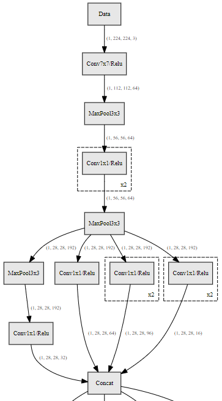
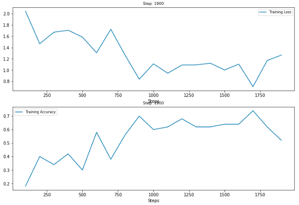

# HiddenLayer

Draw neural network graphs and display training progress. Supports PyTorch and Tensorflow, and has been tested on Ubuntu, OS X, and Windows (TODO: verify). 


## Key Features

### 1. Readable Graphs:
 HiddenLayer hides irrelevant nodes and groups layers that are commonly used together (such as Conv / BN / Relu) into one node so that the generated graph is simple and readable. And you can customize this behavior to control how your graphs are displayed.




### 2. Dynamic Training Metrics:




## Demos

- [`Graph demo (TensorFlow)`](demos/tf_graph.ipynb): This notebook illustrates what API to use to generate graphs for various TF SLIM models (VGG 16, ResNet v1 50, Inception v1, Alexnet v2, and Overfeat). Here's the tail of the TF SLIM Inception v1 generated by hiddenlayer:

- [`Graph demo (PyTorch)`](demos/pytorch_graph.ipynb): This notebook shows how to generate graphs for a couple Pytorch torchivsion models (VGG16 and ResNet 50). Here's the tail of the ResNet 50 model:

- [`Training demo (TensorFlow)`](demos/tf_train.ipynb): This notebook demonstrates how to visualize accuracy and loss during the training process with TensorFlow. Here's a sample visualization:


- [`HiddenLayer demo (PyTorch)`](demos/pytorch_train.ipynb): This notebook shows how to visualize accuracy and loss during the training process with PyTorch. Here's a sample visualization:


## Customizing Graphs

TODO


## Customizing Metrics Visualization


# Installation

## Prerequisites
TODO

## From GitHub (Developer Mode)
Use this option if you want to be able to change the library locally.

```bash
# Clone the repository
git clone git@github.com:waleedka/hiddenlayer.git
cd hiddenlayer

# Install in developer mode
pip install -e .
```

## Install with Conda
This is the recommended method (unless you plan to edit the library, in which case use the Github method above). 

```bash
conda install graphviz python-graphviz
```

**Otherwise:**
* [Install GraphViz](https://graphviz.gitlab.io/download/)
* Then install the [Python wrapper for GraphViz](https://github.com/xflr6/graphviz) using pip:
    ```
    pip3 install graphviz
    ```


