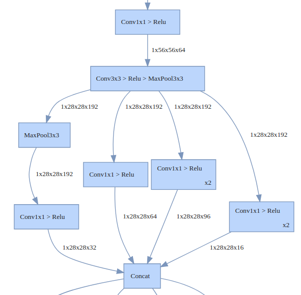
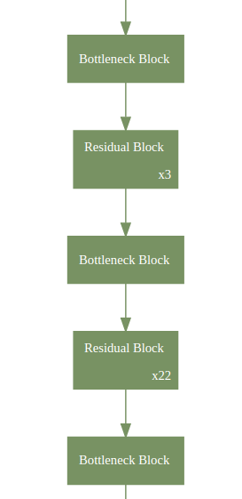
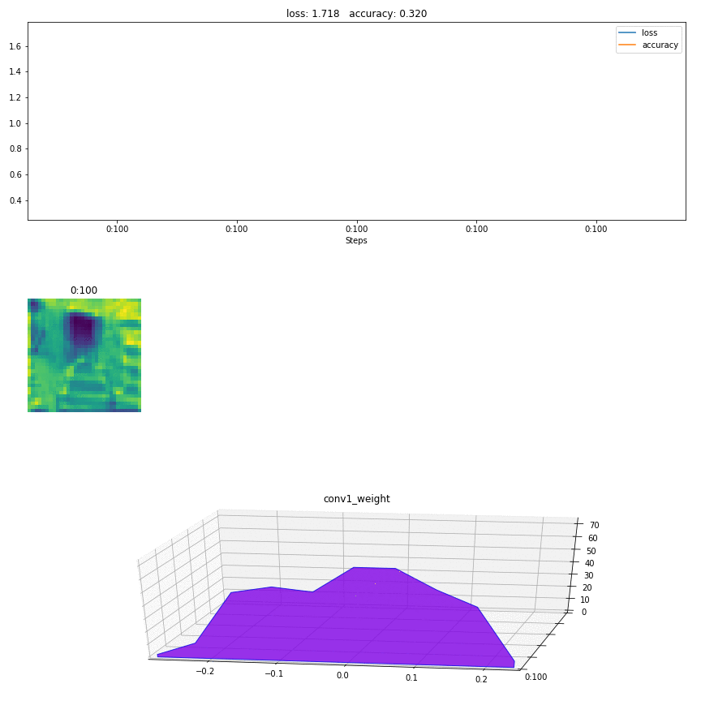
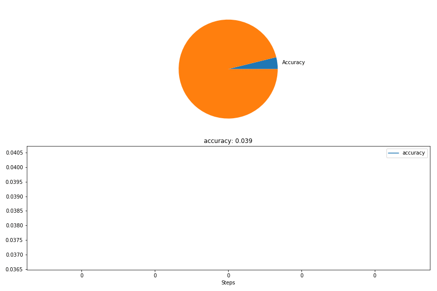
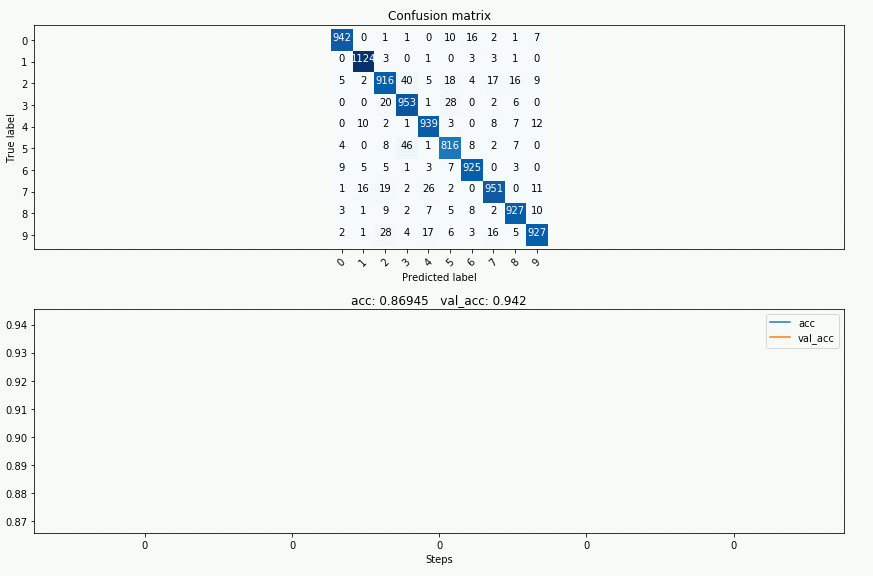

# HiddenLayer

A lightweight library for neural network graphs and training metrics for PyTorch, Tensorflow, and Keras.

HiddenLayer is simple, easy to extend, and works great with Jupyter Notebook.
It's not intended to replace advanced tools, such as TensorBoard, but rather for cases where advanced tools are too big for the task.
HiddenLayer was written by Waleed Abdulla and Phil Ferriere, and is licensed under the MIT License.

## 1. Readable Graphs

Use HiddenLayer to render a graph of your neural network in Jupyter Notebook, or to a pdf or png file.
See Jupyter notebook examples for [TensorFlow](demos/tf_graph.ipynb), [PyTorch](demos/pytorch_graph.ipynb), and [Keras](demos/keras_graph.ipynb).

 

The graphs are designed to communicate the high-level architecture. 
Therefore, low-level details are hidden by default (e.g. weight initialization ops, gradients, internal ops of common layer types, ...etc.). 
HiddenLayer also folds commonly used sequences of layers together.
For example, the Convolution -> RELU -> MaxPool sequence is very common, so they get merged into one box for simplicity.

**Customizing Graphs**

The rules for hiding and folding nodes are fully customizable. You can use `graph expressions` and `transforms` to add your own rules. For example, this rule folds all the nodes of a bottleneck block of a ResNet101 into one node.
```
    # Fold bottleneck blocks
    ht.Fold("((ConvBnRelu > ConvBnRelu > ConvBn) | ConvBn) > Add > Relu", 
            "BottleneckBlock", "Bottleneck Block"),
```




## 2. Training Metrics in Jupyter Notebook

If you run training experiments in Jupyter Notebook then you might find this useful.
You can use it to plot loss and accuracy, histograms of weights, or visualize activations of a few layers.




**Outside Jupyter Notebook:**

You can use HiddenLayer outside Jupyter Notebook as well. In a Python script running from command line, it'll open a separate window for the metrics. 
And if you're on a server without a GUI, you can save snapshots of the graphs to png files for later inspection. See [history_canvas.py](demos/history_canvas.py) for an example of this use case. 


## 3. Hackable

HiddenLayer is a small library. It covers the basics, but you'll likely need to extend it for your own use case. For example, say you want to represent the model accuracy as a pie chart rather than a plot.
This can be done by extending the `Canvas` class and adding a new method as such:

```
class MyCanvas(hl.Canvas):
    """Extending Canvas to add a pie chart method."""
    def draw_pie(self, metric):
        # set square aspect ratio
        self.ax.axis('equal')
        # Get latest value of the metric
        value = np.clip(metric.data[-1], 0, 1)
        # Draw pie chart
        self.ax.pie([value, 1-value], labels=["Accuracy", ""])
```

See the [pytorch_train.ipynb](demos/pytorch_train.ipynb) or [tf_train.ipynb](demos/tf_train.ipynb) for an example.



The [`keras_train.ipynb`](demos/keras_train.ipynb) notebook contains an actual training example that illustrates how to create a custom `Canvas` to plot a confusion matrix alongside validation metrics:



# Demos

**PyTorch:**
- [`pytorch_graph.ipynb`](demos/pytorch_graph.ipynb):
This notebook shows how to generate graphs for a few popular Pytorch models.
- [`pytorch_train.ipynb`](demos/pytorch_train.ipynb): Explains tracking and displaying training metrics.
- [`history_canvas.py`](demos/history_canvas.py): An example of using HiddenLayer without a GUI.

**TensorFlow:**

- [`tf_graph.ipynb`](demos/tf_graph.ipynb): This notebook illustrates how to generate graphs for various TF SLIM models.
- [`tf_train.ipynb`](demos/tf_train.ipynb): Demonstrates tracking and visualizing training metrics  with TensorFlow.
- [`history_canvas.py`](demos/history_canvas.py): An example of using HiddenLayer without a GUI.

**Keras:**
- [`keras_graph.ipynb`](demos/keras_graph.ipynb): This notebook illustrates how to generate graphs for various Keras models.
- [`keras_train.ipynb`](demos/keras_train.ipynb): Demonstrates model graphing, visualization of training metrics, and how to create a custom Keras callback that uses a subclassed `Canvas` in order to plot a confusion matrix at the end of each training epoch.

# Contributing

HiddenLayer is released under the MIT license.
Feel free to extend it or customize it for your needs. If you discover bugs, which is likely since this is an early release, please do report them or submit a pull request.

If you like to contribute new features, here are a few things we wanted to add but never got around to it:
- Support for older versions of Python. Currently, it's only tested on Python 3.6.
- Optimization to support logging big experiments.


# Installation

## 1. Prerequisites

- a. Python3, Numpy, Matplotlib, and Jupyter Notebook. 
- b. Either TensorFlow or PyTorch
- c. GraphViz and its Python wrapper to generate network graphs. The easiest way to install it is 

    **If you use Conda:**
    ```bash
    conda install graphviz python-graphviz
    ```
    
    **Otherwise:**
    * [Install GraphViz](https://graphviz.gitlab.io/download/)
    * Then install the [Python wrapper for GraphViz](https://github.com/xflr6/graphviz) using pip:
        ```bash
        pip3 install graphviz
        ```

## 2. Install HiddenLayer

### a. Clone From GitHub (Developer Mode)
Use this if you want to edit or customize the library locally.

```bash
# Clone the repository
git clone git@github.com:waleedka/hiddenlayer.git
cd hiddenlayer

# Install in dev mode
pip install -e .
```

### b. Using PIP ("stable" release)
```bash
pip install hiddenlayer
```

### c. Install to your `site-packages` directly from GitHub
Use the following if you just want to install the latest version of the library:

```bash
pip install git+https://github.com/waleedka/hiddenlayer.git
```
