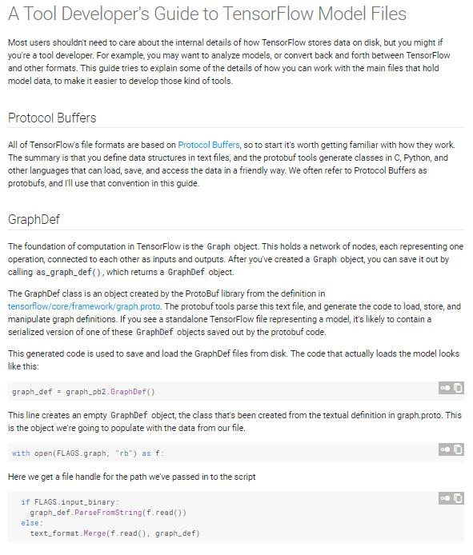
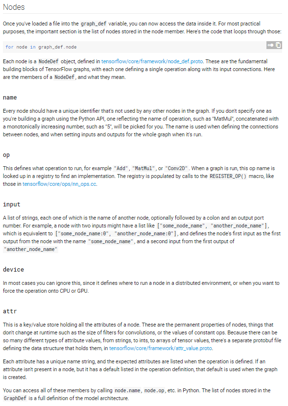
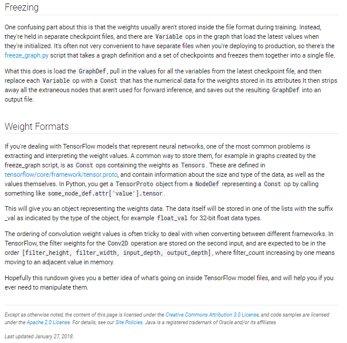
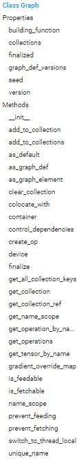
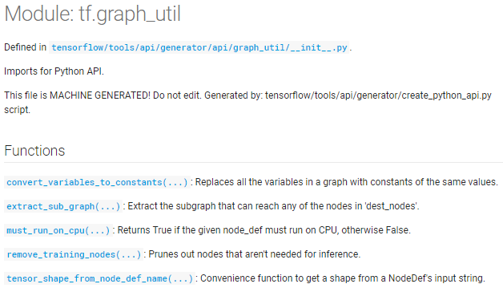

# TF Dev Notes

## Tensorflow graphs

### Developer's Guide to TensorFlow Model Files

[web](https://www.tensorflow.org/extend/tool_developers/)






### tf.Graph

[web](https://www.tensorflow.org/api_docs/python/tf/Graph)



### tf.graph_util

[web](https://www.tensorflow.org/api_docs/python/tf/graph_util)



## tf.contrib.slim layers

[github](https://github.com/tensorflow/tensorflow/blob/master/tensorflow/contrib/layers/python/layers/layers.py)

```python
__all__ = [
    'avg_pool2d', 'avg_pool3d', 'batch_norm', 'bias_add', 'conv2d', 'conv3d',
    'conv2d_in_plane', 'conv2d_transpose', 'conv3d_transpose', 'convolution',
    'convolution2d', 'convolution2d_in_plane', 'convolution2d_transpose',
    'convolution3d', 'convolution3d_transpose', 'dense_to_sparse',
    'dropout', 'elu', 'flatten', 'fully_connected', 'GDN', 'gdn',
    'images_to_sequence', 'layer_norm', 'linear', 'pool', 'max_pool2d',
    'max_pool3d', 'one_hot_encoding', 'relu', 'relu6', 'repeat',
    'scale_gradient', 'separable_conv2d', 'separable_convolution2d',
    'sequence_to_images', 'softmax', 'spatial_softmax', 'stack', 'unit_norm',
    'legacy_fully_connected', 'legacy_linear', 'legacy_relu', 'maxout'
]
```
